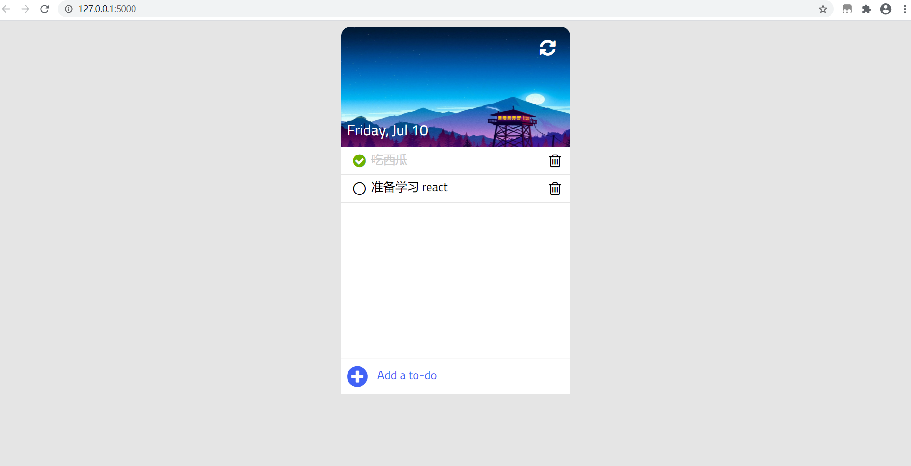
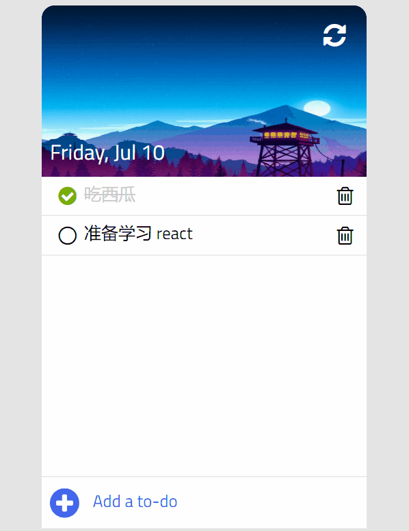

## node 项目

## 项目一：任务事项管理程序
## 介绍
 1. AJAX 保存数据：使用 Node.js 搭配 Express 框架搭建 API ， 使用了 MVC 结构，将项目结构模块化。 页面各个功能按钮与对应的 API 进行绑定，页面数据与服务器数据同步，从而实现保存数据的效果。
 2. 用户可以添加、删除、修改、标记事项。

 ## 截图

## 项目二：个人博客
## 介绍
1. 基于 node.js 的 Express 实现的个人博客
2. 实现的支持博主在线添加博文，游客评论功能
3. 数据逻辑偏重前端处理，动态数据通过Ajax 获取并在前端渲染 HTML 代码， 后端设计了 Restful数据接口

## 项目三：桌面应用程序
## 介绍
1. 使用原生 JavaScript 实现，支持了播放、暂停、切歌、循环播放、歌曲进度控制和播放时间显示等常用功能。
2. 用户可以点击收藏或者喜欢，还可以查看歌曲相应的简介，并且支持兼容各种音乐格式。
3. 在此基础上，实现基于 Electron 开发的音乐播发器。 Node.js 载入本地文件和控制播放暂停。

